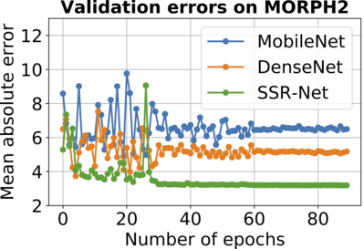

# Model Card for Age Estimation

## Age Estimation:

Age Estimation based on images is a powerful technology that has the potential to revolutionize various industries and applications. The key areas where age Estimation can be used is in retail, defence and tourism. By using CNN models to predict the age of customers, retailers can tailor their marketing strategies to specific age groups.

##### Use Cases:

- For example, a clothing store can use age Estimation to show different advertisements to different age groups, or to display clothing items that are more likely to appeal to certain age groups.
- For example, an age Estimation system can be used to provide age-specific information about historical sites and landmarks, or to provide recommendations for activities and attractions that are more likely to be of interest to certain age groups.
- Another area where age Estimation can be used is in defense. By identifying the age of individuals, security systems can be tailored to better protect specific age groups, or to focus on identifying potential threats from certain age groups.

## Model Description:

**Model type**: Regression

**Model Architecture:** The SSR-Net (Soft Stagewise Regression) model is a neural network architecture designed for image-based age estimation. The model uses a stagewise strategy to divide the age range into multiple stages, and for each stage, it uses a soft regression approach to predict the probability of the subject's age belonging to that stage. The model also uses attention mechanisms to focus on the most informative regions of the face for age estimation. The SSR-Net model has been shown to achieve state-of-the-art performance on several benchmark datasets for age estimation. https://github.com/shamangary/SSR-Net/blob/master/ijcai18_ssrnet_pdfa_2b.pdf

**Model Inputs:** Image [64 X 64 X 3]

**Model Outputs:** Within each analyzed photo frame, the model output include: Single Value - Target Face age (in years)

**Note:** This is a pretrained model from https://github.com/shamangary/SSR-Net repository. This is not a production ready model and it is meant to be used for demo purposes only.

## Performance Metrics:

Overall model performance, were assessed, including:

- MAE (Mean Absolute error) values - Mean Absolute Error (MAE) is a commonly used performance metric for regression tasks. MAE provides a direct and intuitive way to evaluate the model's performance by measuring the average difference between the predicted and actual ages. It is a robust metric for large age range datasets like Morph2. Additionally, it does not penalize large errors as much as Mean Squared Error (MSE), which makes it more suitable for datasets with outliers.



In above graph you can see the performance of the model using Morph2 validation dataset. 80% of images were used as the training set while the remaining. 20% acted as the validation set.

- The model achieved MAE of 3.16 which is better than MobileNet(6.50) and DenseNet(5.05) – lower the better


## Size and Latency:

| Model Type | Size | Inference Time (on EdgeECAM50_USB)|
| ---------- | ----- | ------ |
|   Float32  | 191 kB | 658 ms |


## Limitations:
- The model's performance may be affected by variations in lighting, texture, size and cap orientation. Additionally, the model may not be able to detect colors outside of the four target classes.

## Dataset:

The dataset used is called Morph2 dataset.

Summary:
- The Morph2 dataset contains over 55,000 images of faces with a wide range of ages, from infants to elderly adults.
- Split into 80:20 ratios for Training, Validation sets.
- The dataset contains a high degree of variability in terms of age, ethnicity, and gender. Additionally, the dataset includes images of individuals with different facial features, hairstyles, and occlusions such as glasses, hats, and scarfs, which can make it challenging for the model to accurately predict the age of a person.

Annotations:

- The ages of the individuals in the images were annotated manually by human annotators based on the visual appearance of the face.

## Summary:

Overall, age Estimation based on images is a true marvel of technology that has the potential to enhance various aspects of our lives, from retail and defence to tourism and beyond. However, it's important to note that the technology is not always accurate and could perpetuate biases, so it should be used with ethical considerations in mind. It should also be worth noting that the model should not detect or provide any information about identity or demographics, allowing for focused, unbiased analysis.

## Citation:
```
@inproceedings{ijcai2018p150,
  title     = {SSR-Net: A Compact Soft Stagewise Regression Network for Age Estimation},
  author    = {Tsun-Yi Yang and Yi-Hsuan Huang and Yen-Yu Lin and Pi-Cheng Hsiu and Yung-Yu Chuang},
  booktitle = {Proceedings of the Twenty-Seventh International Joint Conference on
               Artificial Intelligence, {IJCAI-18}},
  publisher = {International Joint Conferences on Artificial Intelligence Organization},
  pages     = {1078--1084},
  year      = {2018},
  month     = {7},
  doi       = {10.24963/ijcai.2018/150},
  url       = {https://doi.org/10.24963/ijcai.2018/150},
}
```


