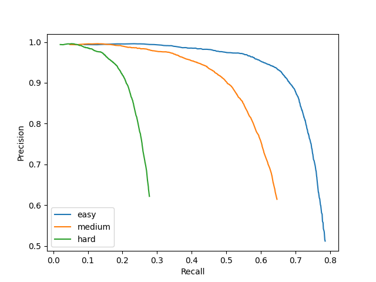

# Model Card for Face Detection

## Face Detection:

This powerful model is a true marvel of technology, capable of seamlessly scanning images or video frames for the presence of one or more faces even in crowds. With precision and accuracy, it then expertly encases each face in a bounding box for easy identification. Its singular focus is to locate and identify faces within an image, without delving into identifying specific individuals or demographics.

##### Use Cases:

- Face detection can be used to analyze crowd behavior and movement patterns. It is important to note that the lack of identity or demographic information is a key feature of this use case.
- Face detection can help track the movement of individuals and identify congestion points without violating privacy or generating bias. This technology can help with crowd management and planning, as well as identifying potential security threats.
- This can help researchers gather valuable data without compromising privacy or generating bias based on demographics.

## Model Description:

**Model type**: Detection

**Model Architecture:** YuFaceDetectNet fine-tuned for face detection with a single shot multibox detector. It adopts a light MobileNet as the backbone. It has more convolution layers on each stride to have fine-grained features, and detects on the extra layer of stride, which improves the recall of small faces.

**Model Inputs:** Image [240 X 320 X 3 ]

**Model Outputs:** Within each analysed image frame, the model outputs include:-
- Precise bounding box coordinates, outlining the exact location of each face.
- Confidence scores for both detection and landmarking, providing an added layer of assurance in the model's accuracy.

**Note:** This model was developed and optimized inhouse at e-con Systems. This model is meant to be used only for demo purposes.

## Performance Metrics:

Overall model performance, were assessed with Mean Average Precision(mAP), mAP is a metric used to evaluate object detection models such as Fast R-CNN, YOLO, Mask R-CNN, etc. The mean of average precision(AP) values are calculated over recall values from 0 to 1.

- Model performance were tested on Easy, Medium and Hard validation sets in the WIDER FACE dataset. The hard set is even more challenging, combining faces with more blurriness, less size and higher occlusions.

| Metrics   | 320X240 (float32) | 320X240 (INT8) |threshold| wider dataset Type|
|-----------|-------------------|----------------|---------|-------------------|
| mAP       | 0.76              | 0.74           |0.3      |easy               |
| mAP       | 0.61              | 0.60           |0.3      |medium             |
| mAP       | 0.26              | 0.25           |0.3      |hard               |
| mAP       | 0.73              | 0.70           |0.5      |easy               |
| mAP       | 0.55              | 0.52           |0.5      |medium             |
| mAP       | 0.23              | 0.22           |0.5      |hard               |

- pr_curve Float32

 

- pr_curve Int8




- Face size, facial orientation, and degree of occlusion all have a significant impact on model performance.
- The model has been evaluated on three kinds of validation sets, viz. Easy, Medium, and Hard to detect faces in images. Also, threshold chosen was 0.3 and 0.5 for the tests.
- The model has been evaluated after Quantization (Float32 -> INT8) as well, since the primary concern is also to deploy on TinyML devices with minimum accuracy loss.


## Size and Latency:

| |Size | Inference Time (on EdgeECAM50_USB) |
| ------ | ----- | ------ |
| Int8 | 177 kB | 598 ms |
| Float32 | 358 kB | 1620 ms |
 
## Limitations:
The following factors may degrade the model’s performance.
- Face size: Though it performs well on crowds. Depending upon image resolution, faces that are smaller in range (10-20px or less) might be difficult to detect.
- Occlusions: Heavily occluded images (over 30% of area) might not be detected well. Best is 14.4% area of occlusion.
- Pose: Out of plane (yaw larger than 90 deg, roll larger than 30 deg) might be difficult to detect.

## Dataset:

The dataset used is called WIDER FACE DATASET http://shuoyang1213.me/WIDERFACE/index.html
Released in 2016 it is the most popular and widely used face detection dataset collected mainly from search engines.

Dataset Summary:
- 32,203 images and labelled 393,703 faces with a high degree of variability in scale, pose and occlusion.
- Split into 40:10:50 ratios for Training, Validation and Test Datasets
- Average no of faces per image is 12.2
- Average height of faces is 10-50 px

Annotations:
- Bounding boxes tightly containing forehead, chin and cheek for each recognizable face.
- Estimated bounding box for an occluded face.


## Summary:

Overall, face detection's ability to provide unbiased analysis without collecting identifying or demographic information can be beneficial in various fields, including transportation, public safety, and research. With this model, you'll gain valuable insights into its performance on images of varying characteristics. Whether you're working with high-quality images or more challenging ones, you'll gain a clear understanding of the model's strengths and limitations, ensuring that it's used to its fullest potential.


## Citation:
```
@article{eiou,
author={Peng, Hanyang and Yu, Shiqi},
journal={IEEE Transactions on Image Processing},
title={A Systematic IoU-Related Method: Beyond Simplified Regression for Better Localization},
year={2021},
volume={30},
pages={5032-5044},
doi={10.1109/TIP.2021.3077144}
}

@article{facedetect-yu,
author={Yuantao Feng and Shiqi Yu and Hanyang Peng and Yan-ran Li and Jianguo Zhang}
title={Detect Faces Efficiently: A Survey and Evaluations},
journal={IEEE Transactions on Biometrics, Behavior, and Identity Science},
year={2021}
}
```

