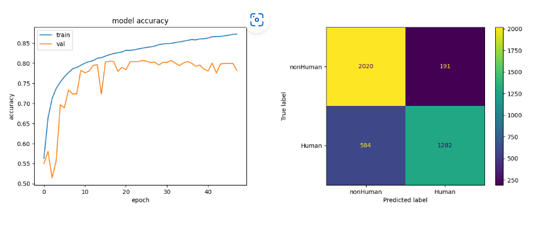

# Model Card for Person Detection

## Person Detection:

Detecting Person in an image is a crucial task with various applications, including surveillance, robotics, and autonomous vehicles. This model is optimized for mobile and embedded platforms and aims to detect person objects in an image while classifying them as person or non-person. By accurately detecting persons, this technology can greatly enhance safety and security measures in a variety of industries.

##### Use Cases:

- Surveillance: Enhance public safety and security by accurately detecting persons in public spaces.
- Robotics: Ensure safe collaboration between person workers and robots in industries like manufacturing.
- Autonomous Vehicles: Ensure the safety of passengers and other road users by detecting pedestrians and cyclists in the road.

## Model Description:

**Model type**: Binary Classification

**Model Architecture:** The MobileNetV2 architecture is used to design the person detection model. It employs a streamlined architecture consisting of depth-wise separable convolutions to reduce the number of computations while maintaining the accuracy of the model. This architecture allows the model to perform person detection tasks with fewer parameters and computations, making it suitable for mobile and embedded platforms with limited computational resources.

The input to the model is an image, which is passed through the depth-wise convolutional layers to extract features. These features are then passed through a fully connected layer, which outputs a binary classification indicating whether the image contains a person or not.

**Model Inputs:** Image [96 X 96 X 3]

**Model Outputs:** Within each analyzed image frame, the model output include: -
- Single Value [0.0, 1.0]: ‘No person Found’ else ‘Person Found’

**Note:** This model was developed and optimized inhouse at e-con Systems. This model is meant to be used only for demo purposes.

## Performance Metrics:

The model was evaluated on three datasets - train, validation, and test - with the following performance metrics:

| Sets | accuracy | f1_score | split_ratio |
| ------ | ------ | ------ | ------ |
| train | 84.3% | 81.3% | 67% |
| validation | 80.3% | 75.6% | 26% |
| test | 80.9% | 77.7% | 6% |

The accuracy, f1_score, and split ratio are the three-performance metrics used to evaluate the model. The model achieved an accuracy of 80.9% on the test set, which indicates that it can accurately classify person and non-person in images.

- Accuracy measures the proportion of correct predictions made by the model among all the predictions it made.
- F1 score is a harmonic mean of precision and recall, and takes both precision and recall into account.
- Accuracy can be misleading when classes are imbalanced, and we need additional metrics such as F1 score.
- A higher accuracy or F1 score indicates better performance of the model.

## Size and Latency:

| Model Type |Size | Inference Time (on EdgeECAM50_USB|
| ------ | ----- | ------ |
| int8 | 161 kB | 28 ms |
| float | 258 kB | 152 ms |

## Limitations:
The following factors may degrade the model’s performance.
- The model may not perform well on images with poor lighting conditions, occlusions, or complex backgrounds.
- The model may also be biased towards certain demographics, depending on the training data used.

## Dataset:

The model was trained and evaluated on a dataset of images containing person and non-person objects. The dataset was split into three sets - train, validation, and test - with a split ratio of 67%, 26%, and 6%, respectively. The dataset was collected from various sources, and care was taken to ensure that it was diverse and representative of different demographics.

## Summary:

Person Detection is a powerful technology that can be used in various applications, from surveillance to robotics. The model is based on CNNs and can accurately detect person objects in images. However, it's important to consider the limitations of the model and use it responsibly to avoid potential biases and ethical issues.
