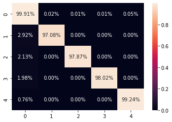

# Model Card for Test Tube Cap Detection

## Test Tube Cap Detection

The model is intended to be used to detect the test tube caps based on the color of test tube caps. It can be used in laboratories, research facilities, or any other setting where detecting the test tube caps based on the color of test tube caps is necessary.

##### Use Cases:

- Automated sorting of test tubes based on cap color in a laboratory or research setting.
- Quality control in manufacturing of products that require the use of test tubes with specific-colored caps.
- Identification of color-coded test tubes in medical or clinical settings

## Model Description:

**Model type**: Detection

**Model Architecture:** The model used is FOMO which is based on MobileNetV2 as a base model for its trunk, with only 1/2 the parameters of the original model. The model performs a spatial reduction of 1/n from input to output.

**Model Inputs:** Image (160 X 160 X 3)

**Model Outputs:** Multi-class classification

|  | background | blue cap ('BL') | purple cap ('PR') | red cap ('RD') | yellow cap ('YL') |
| ------ | ------ | ------ | ------ | ------ | ------ |
| class | 0 | 1 | 2 | 3 | 4 |

Note: This model was developed and optimized inhouse at e-con Systems. This model is meant to be used only for demo purposes.

## Performance Metrics:

The model was evaluated using precision, recall, and F1-score metrics on a dataset with five classes. The weighted average accuracy achieved by the model was 99.90%, indicating that it made accurate predictions for most of the samples.

| class | precision | recall | f1-score |
| ------ | ------ | ------ | ------ |
| 0 | 99.9% | 99.9% | 99.9% |
| 1 | 85.8% | 96.6% | 91.0% |
| 2 | 87.8% | 98.0% | 92.6% |
| 3 | 87.9% | 98.0% | 92.7% |
| 4 | 85.9% | 98.9% | 91.7% |

- The precision measures the proportion of true positives among all predicted positives for that class. Above values show that the model has high precision for all classes, indicating that it made few false positive predictions.
- The recall measures the proportion of true positives among all actual positives for that class. Above values show that the model has high recall for all classes, indicating that it correctly identified most of the true positives for each class.
- The f1-score is the harmonic mean of precision and recall. Above values show that the model has high F1-score for all classes, indicating that it has a good balance between precision and recall.

## Size and Latency:

| Model Type |Size | Inference Time |
| ------ | ----- | ------ |
| int8 | 57 kB | 110 ms |
| float | 85 kB | 355 ms |

## Limitations:
- The model's performance may be affected by variations in lighting, texture, size and cap orientation. Additionally, the model may not be able to detect colors outside of the four target classes.

## Dataset:

The model was trained on a custom curated dataset of 8535 images of test tube caps, which were split into training (5491), validation (1373), and test (1671) sets. The target classes were blue cap ('BL') , purple cap ('PR') , red cap ('RD') , yellow cap ('YL').

## Summary:

Test tube cap detection is an important application in the field of biomedical research and laboratory science. The CNN-based model can accurately classify test tube caps in images, which can assist in various tasks such as inventory management and quality control. However, it's important to validate the model on a diverse dataset to ensure its reliability and generalizability. It's also important to acknowledge the potential biases and limitations of the model, such as its ability to classify caps of different colors, sizes, and textures.

## Credits:

